# 数据库结构说明

本服务端使用 PostgreSQL 保存本地玩家数据。：

- 用户相关表：`user_xxxxxxx`
- 用户道具相关表：`user_item_xxxxxx`
- 用户角色相关表：`user_character_xxxxxxx`
- 角色静态资源表：`wds_static_character`
- 道具静态资源表：`wds_static_item`
- 其他静态资源表：`wds_static_xxxxxx`
- 其他系统功能表：`system_xxxxxx_xxxxxxx`
- 用户外键字段统一使用 `"userId"`，不使用 `user_id`

## 用户核心表

`user_accounts` 是账号根表。`id` 是服务端内部用户 ID，`public_id` 是客户端展示用的 10 位玩家 ID。

`user_login_identities` 用于把登录 token hash 映射到 `"userId"`。

`user_auth_sessions` 保存已签发的 API token。

`user_states` 保存兼容旧逻辑用的 JSON 状态快照。

`user_game_states` 保存等级、经验、体力、新手教程状态、已读标记、登录时间等游戏进度；`stamina_jewel_recovery_count` 对应官方 `key0` 中的钻石恢复体力次数。

`user_profiles` 保存玩家昵称、简介、主页角色、称号装饰和公开资料设置；`updated_at` 记录资料最后更新时间，启动迁移会为旧数据库补齐该列。

## 角色相关表

`wds_static_character` 保存从 `masterdata-export/CharacterMaster.json` 导入的角色和卡牌 master 数据，原始行会保存在 `payload` 字段中。

`user_character_bases` 保存玩家已拥有的角色基础数据。

`user_character_cards` 保存玩家已拥有的 Actor / 卡牌实例，关联 `"userId"`，并可关联 `user_character_bases(id)`。

`skill_level` 对应客户端 `Character.SenseLevel`，默认 1，必须大于等于 1。历史零值由启动迁移修正为 1；已有强化等级保持不变。零值会导致客户端无法匹配 EffectMaster 的等级效果并中断编队刷新。

`Characters/{id}/EnhanceSenseLevel/{target}` 根据 CharacterMaster key14 与 CharacterSenseEnhanceItemGroupMaster 按当前等级累计材料消耗，事务内锁定角色、条件扣库存、更新 skill_level；响应 present 返回 Character union4 与 ItemPossession union27。相同目标重试不重复扣除，跨级材料不足整体回滚。Primary Sense（priority=1）范围 1–5；Secondary Sense 尚未持久化，priority=2 明确拒绝，不能返回虚假成功。非法参数为 `CHARACTER_SENSE_INVALID_REQUEST`（400），角色不存在/不属于账号为 `CHARACTER_SENSE_CHARACTER_MISSING`（404），倒退目标为 `CHARACTER_SENSE_LEVEL_CONFLICT`（409），材料不足为 `CHARACTER_SENSE_ITEM_INSUFFICIENT`（409）；有效会话认证规则与社团写接口一致。

`user_character_costumes` 保存玩家已拥有的服装。

`user_character_mission_states` 按玩家、CharacterBaseMasterId、任务主数据 ID 保存服务端已确认次数与已领取阶段，复合主键约束重复状态。演出开始时 `user_live_sessions.character_mission_party` 固定本场真实持有的编队角色；有效结算在原事务内累计公演和 Star Act 次数，重复结算返回缓存而不累加。角色卡牌实际等级、Sense 等级、已读角色故事用于其他可验证任务，未记录的历史演出次数不推测补发。`receiveAllMission`、批量领取及独立的 `receiveKeyMission` 共用账号锁：只对新完成阶段授予主数据星点，更新 CharacterBase、已领取状态并通过 union5/96 同步。无任务进度时返回零新增星点；未知角色返回 `CHARACTER_MISSION_CHARACTER_MISSING`（404），非法批量参数返回 `CHARACTER_MISSION_INVALID_REQUEST`（400）。

`user_home_display_preferences` 保存主页展示角色和服装布局。

## 道具相关表

`wds_static_item` 保存从 `masterdata-export/ItemMaster.json` 导入的道具 master 数据，原始行会保存在 `payload` 字段中。

`user_item_currencies` 保存免费剧宝石、付费剧宝石和金币数量。

`user_item_possessions` 保存玩家持有的普通道具数量。每个 `"userId"` 和 `item_master_id` 组合唯一。

`user_item_inbox_packages` 保存礼物箱或收件箱中的奖励及领取状态；`updated_at` 记录最后更新时间，启动迁移会为旧数据库补齐该列。

## 社团相关表

`system_circles` 保存实际创建的社团及名称、简介、活动时间、加入条件、偏好和 MessagePack 横幅。唯一的 `"ownerUserId"` 关联创建者。`id` 是内部 GUID，不用于客户端标签；`display_id` 通过 `system_random_circle_display_id()` 随机生成唯一 8 位数字（10000000–99999999）。唯一索引仲裁并发碰撞，创建语句发生冲突时有界重试。旧递增编号启动时一次性改为随机编号，`previous_display_id` 保留旧数字编号作为查询别名；通过 identity 标记判断是否需要迁移，后续启动保持随机编号稳定，不改写社团主键或成员外键。查询和横幅更新兼容旧 GUID、旧数字编号及新显示 ID。

`user_circle_memberships` 保存成员所属社团和权限，主键 `"userId"` 保证一个玩家最多属于一个社团；`circle_id` 外键和索引用于读取成员。创建社团和写入会长成员关系在同一事务中完成，账号行锁串行化同一玩家的并发创建，相同参数重试返回同一社团，不重复写入。

`Circles/RecommendUsers` 返回真实公开且未入会玩家，限制 50 人；使用社团申请列表相同的有效会话、社团存在性与管理员权限检查，遵循 CircleSearchResult 三字段和五帧协议。

客户端 `User.CircleId`（key11）通过成员表关联社团并读取 `display_id`，创建响应通过 User union0 即时同步，重新登录也保持一致。表由启动迁移自动创建，不改写已有账号数据。删除账号或社团时对应记录按外键级联清理。

## 好友相关表

`user_friend_relationships` 保存已经成立的好友关系。好友关系会保存为两条方向记录，因此每个玩家都可以独立保存收藏好友等本地状态。

`user_friend_requests` 保存好友申请历史。`"fromUserId"` 是申请发送者，`"toUserId"` 是申请接收者，`status` 通常为 `pending`、`accepted`、`denied` 或 `cancelled`。

`user_friend_blocks` 保存玩家黑名单。拉黑时会移除双方之间冲突的待处理申请和已成立好友关系。

## 抽卡相关表

`user_gacha_histories` 保存持久化抽卡记录。字段会记录 `"userId"`、`gacha_detail_master_id`、结果类型、结果 master id、稀有度、是否 pickup、抽取时间等信息。

抽卡获得的角色或道具会同步写入对应的用户角色表或用户道具表，而 `user_gacha_histories` 作为客户端展示抽卡历史的记录来源。

## 主页与通知表

`user_home_bgms`、`user_home_skins`、`user_home_skin_possessions` 保存主页 BGM、主页皮肤和皮肤持有状态。

`system_notifications` 保存面向所有玩家展示的系统公告。公告正文以客户端可读取的 JSON body 保存。

`user_notification_reads` 保存每个玩家对系统公告的已读时间。

## 其他系统表

`system_invite_codes` 保存邀请码状态。

`system_live_sessions` 保存本地 Live 游玩和结算状态。

`system_multi_rooms` 保存本地多人房间状态，`"ownerUserId"` 关联 `user_accounts(id)`。

## 初始化行为

服务端启动时，`DatabaseMigrator` 会自动创建缺失的表和索引。

如果 master data 文件存在，启动时会把 `CharacterMaster.json` 导入 `wds_static_character`，把 `ItemMaster.json` 导入 `wds_static_item`。

玩家注册或首次认证时，`UserDataService.InsertDefaultUserDataAsync` 会创建默认档案、游戏状态、初始角色、初始卡牌、初始服装、队伍、货币、主页设置和默认道具。

## 社团剧场体力

`user_circle_memberships.stamina_last_received_at` 记录每位成员上次领取剧场体力的时间。新成员首次领取按 300 点上限计算；之后按每小时 4.17 点累计、最多 300 点。领取时锁定成员行，在同一事务中更新时间与玩家体力，重复或并发请求不会重复发放。

`system_circles.is_publish_ranking` 保存社团排行榜公开开关，仅会长可通过社团接口修改。支援剧团等级上限初始为 10，对应主数据首个可解锁上限 11；客户端不应看到 0/0 MAX。

## 表关系概览

```mermaid
erDiagram
    user_accounts ||--o{ user_login_identities : "拥有"
    user_accounts ||--o{ user_auth_sessions : "拥有"
    user_accounts ||--|| user_game_states : "游戏状态"
    user_accounts ||--|| user_profiles : "玩家资料"
    user_accounts ||--o{ user_character_bases : "拥有角色"
    user_accounts ||--o{ user_character_cards : "拥有卡牌"
    user_accounts ||--o{ user_character_costumes : "拥有服装"
    user_accounts ||--o{ user_item_possessions : "拥有道具"
    user_accounts ||--|| user_item_currencies : "货币"
    user_accounts ||--o{ user_item_inbox_packages : "收件奖励"
    user_accounts ||--o{ user_friend_relationships : "好友关系"
    user_accounts ||--o{ user_friend_requests : "好友申请"
    user_accounts ||--o{ user_gacha_histories : "抽卡记录"
    system_notifications ||--o{ user_notification_reads : "已读状态"
```

## 乐曲收藏状态
`user_music_bookmarks` 保存 key 146 的乐曲收藏夹状态，`bookmark_state` 与官方 `/api/Lives/Music/EditBookmark` 的第二个请求值保持一致；`0` 表示移出收藏夹，`1/2/4` 等值按客户端原样保存。

## 商店浏览状态
`user_shop_last_views` 保存 key 65 的商店/活动页最后浏览时间，由 `/api/Shops/UpdateLastViewedAt` 按客户端请求自适应更新，并在 `/api/data/user` 中回放。

## Live 与奖励计算相关表
`wds_static_live`、`wds_static_additional_reward_package`、`wds_static_audition_reward_package`、`wds_static_episode_reward_package`、`wds_static_league_play_reward_package`、`wds_static_league_reward_package` 保存 Live、剧情和联赛奖励计算所需的 MasterData。数组字段暂以 `payload` 或 `rewards` JSONB 保留，避免在字段语义未完全确认前写错列名。

`user_live_play_results` 保存 key 24 的谱面成绩：`achievement_rate` 为最佳达成率，`notation_rate` 为最佳谱面 rate，`clear_lamp` 为通关灯，`rate_grade` 为评级；旧分数字段保留，不将其误当成达成率。玩家 rating 从难度 1–4 的最高 30 个谱面 rate 汇总，没有成绩时为 0。自动演出不写入手动成绩；未通关或最终 LIFE 为 0 时不产生谱面 rate。计算规格按用户指定的 https://gamerch.com/world-dai-star/786842 实现。

`user_live_sessions` 记录每个玩家当前普通演出的谱面及自动演出标志，缓存 MessagePack 结算结果和提交摘要，保证重复结算不重复发放奖励。开始新演出会替换当前记录；旧客户端的 Finish 请求没有演出 ID，不能区分新演出开始后迟到的旧结算请求。

`user_game_states.rank_limit` 是等级上限，初始 50，和 `max_stamina` 分开存储。升级按 `PlayerRankMaster` 消耗经验并恢复体力，达到上限后经验最多保留至门槛减 1。旧存档中超出门槛的经验在读取前归一化，不清空存档。奖励数量和基础经验暂时仍采用既有普通演出兼容值，不是完整官服奖励计算器。

`user_live_music_states` 保存 key 25 的乐曲解锁/拥有状态。`user_live_lesson_party_states` 保存 key 39 的课程/教程演出队伍状态。`user_live_course_states` 保存 key 90 一类 Live 课程或教程状态，未确认字段保存在 `payload`。

## 活动、商店和媒体状态表
`user_story_event_states` 保存 key 101 的活动点数、排名和提示阅读状态。`user_event_exchange_shop_states` 保存 key 102 的活动兑换商店兑换次数。`user_shop_purchase_states` 保存 key 108 的商店购买次数和限购刷新状态。`user_episode_read_states` 保存 key 95 的剧情阅读状态。`user_photo_records` 保存 key 123 的生成照片记录。`user_photo_states` 保存 key 124 的照片系统状态。`user_music_video_watch_states` 保存 key 131 的音乐视频观看状态。`user_raw_union_states` 作为 key 193 等尚未确认语义的用户状态兜底表。
`user_photo_album_arrangements` 保存 key 125 的相册简单/详细布局，`layout_payload` 以嵌套 MessagePack 二进制保存客户端布局，避免丢失位置、缩放、旋转等字段。

## 官方 data/user 玩家状态补充表
`system_master_data_versions` 保存当前启用的 MasterData 版本、发布时间戳、本地文件路径和远程路径。
`user_player_preferences` 保存 key 2 的玩家偏好，例如当前选中的队伍。
`user_party_groups` 保存 key 6 的队伍分组。
`user_party_slots` 保存 key 7 的队伍槽位。
`user_character_resource_progress` 保存 key 96 的角色资源/解锁进度。
`user_mission_statuses` 保存 key 48 的任务状态。
`user_live_user_stats` 保存 key 67 的玩家 live 统计值。
`user_player_settings` 保存 key 97 的玩家设置。
`user_restriction_states` 保存 key 148 的账号限制状态。
`user_album_groups` 保存 key 174 的相册分组。
`user_invite_states` 保存 key 179 的邀请码状态。
`user_login_bonus_states` 保存 key 109 的登录/活动展示状态。
`user_notification_states` 保存 key 94 的通知已读状态。
`user_game_hint_reads` 保存 key 66 的游戏提示已读状态。

`user_live_lesson_party_states` 保存每个账号、角色的稽古编队，以及领队位置、历史高分和已领取奖励门槛。`user_lesson_sessions` 保存当前稽古角色、谱面、开始时间、开始时的队伍及卡片快照、完成响应和结算摘要；每个账号一行，用于定位不带角色 ID 的结算请求并保证重试幂等。

稽古 `completion` 保存 `[FinishLiveResult, PresentData]`，两个结束入口重放同一事务结果；兼容旧版本仅保存 PresentData 的完成记录。普通演出与稽古按最近开始时间分流，并共用玩家行锁。

常设商店复用 `user_raw_union_states` 保存协议对象：149 为商品购买次数，45/129 为铭牌和装饰持有，182 为头像框集合；购买在玩家行锁下与货币/道具更新一起提交，不新增存储表。

稽古开始快照新增第三项卡片战力映射 `[LessonParty, Cards, StatusByCardId]`，卡片 ID 以十进制字符串作为映射键。旧版两项快照在读取未完成场次时补存第三项，不更改次数或奖励。战力采用解包 CharacterMaster、CharacterLevelMaster、CharacterBloomBonusGroupMaster、EffectMaster 与 CharacterStarRankMaster；星章加成为 `min(当前星章加成, 高分满足的最大加成)`，高分缺省为 0 时上限 2.5%。
